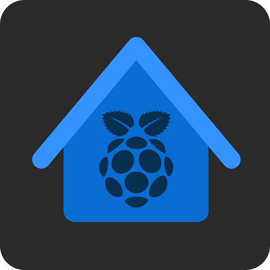

</img>
### This project is under construction.

## About HomePi
HomePI (SmartHome) is an android application that works with raspberry pi and relay boards to control GPIO pins over network!
This project works with a raspberry pi web server that you can find here https://github.com/homepi/homepi

## ScreenShots
</img> </img> </img> </img>

## Contributing
Thank you for considering contributing to the HomePi project!

## License
The HomePI is open-source software licensed under the MIT license.
